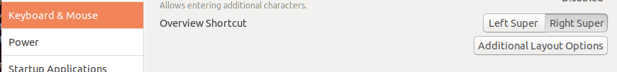
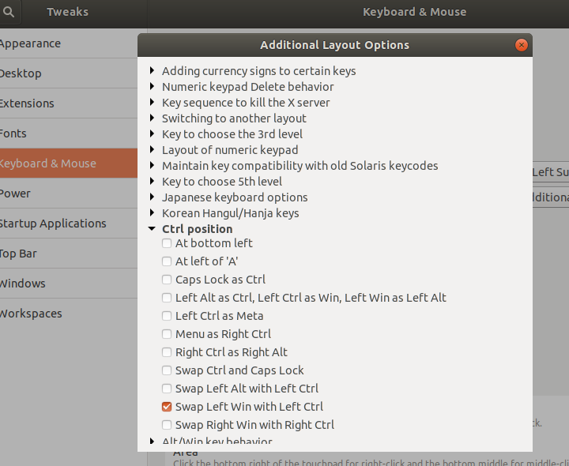

# Running Ubuntu 20.04.1 LTS on an iMac 27 Retina 

This document was written for a late 2012 Retina 27" iMac that I moved to linux due to a hardware instability with Mac OS. 

### Mouse
Mousewheel 

https://dev.to/bbavouzet/ubuntu-20-04-mouse-scroll-wheel-speed-536o

Install imwheel

    sudo apt install imwheel

Install the mousewheel.sh file

Then 

    chmod +x mousewheel.sh
    ./mousewheel.sh

Finally add imwheel in ubuntu startup application.

### Sound 

in 
/etc/modprobe.d/alsa-base.conf

Add 'options snd-hda-intel model=imac27_122' to the end of the file. 

reboot or 

    sudo alsa force-reload

then run the mixer 

    alsamixer

Unmute the Headphone jack and set the sound levels. 

### iSight

https://help.ubuntu.com/community/MactelSupportTeam/AppleiSight?action=show&redirect=AppleiSight

# Remap Keyboar for Mac Keyboard 

From the Ubuntu Forums - 
https://askubuntu.com/questions/131900/how-do-i-switch-the-command-key-and-control-key-on-a-macbook-pro

Install Tweak Tool (This is the name of the app in your app list.)
   
    sudo apt install gnome-tweak-tool

Launch Tweak Tool 

1. First swap the dashboard hotkey to the right side and then under "Additional Layout Options" 
you can use "Ctrl position/ Swap Left Win with Left Ctrl" to good effect.

2. You can use "Ctrl position/ Swap Left Win with Left Ctrl" to good effect.

# Mapping Super (Command/Windows) key to clt. 
For Ubuntu Bungie I had to remap the super key. 

Binding Super to Ctrl
What about binding your left Windows/Logo/Super key to act as another Ctrl key?

You can achieve that with the following xmodmap commands:

    remove mod4 = Super_L
    keysym Super_L = Control_L
    add Control = Control_L

Assuming you saved the above lines as super_as_ctrl.xmodmap you can test out the effect by executing

    xmodmap super_as_ctrl.xmodmap

To make the change permanent (surviving re-login/reboot) rename the file to .Xmodmap in your home folder.

# GTK3 Theme and icons 

Icons Cupertino-BigSur.tar.xz

https://www.gnome-look.org/p/1102582/startdownload?file_id=1594922295&file_name=Cupertino-BigSur.tar.xz&file_type=application/x-xz&file_size=35608344

Theme 

https://www.gnome-look.org/p/1275087/startdownload?file_id=1595596874&file_name=Mojave-dark.tar.xz&file_type=application/x-xz&file_size=561024